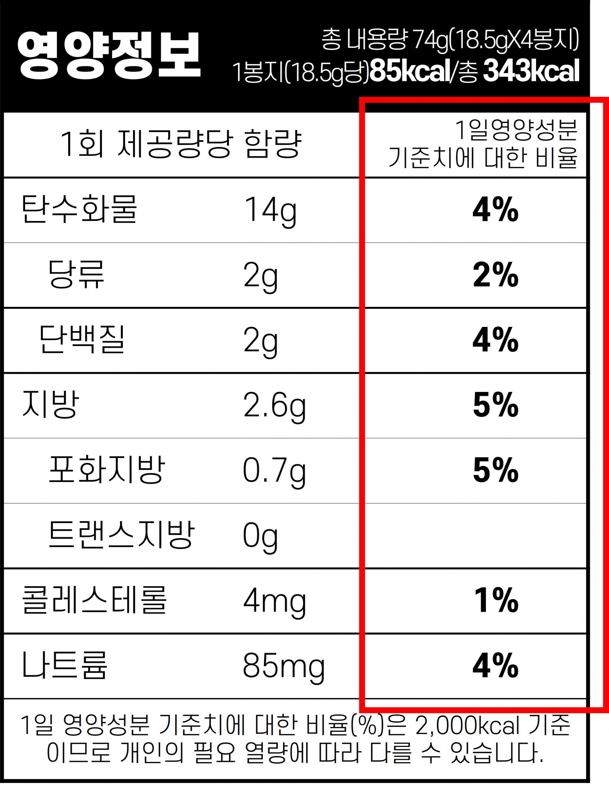
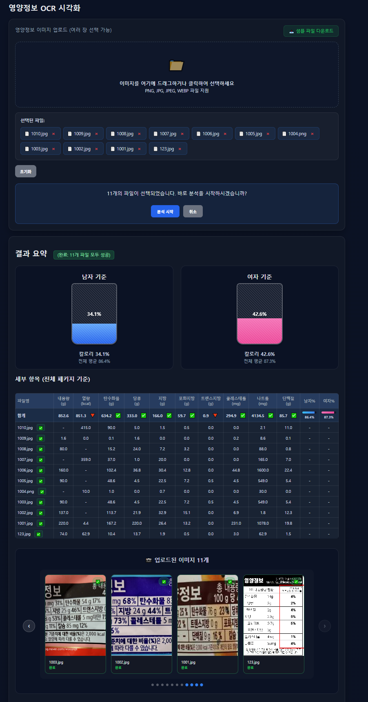
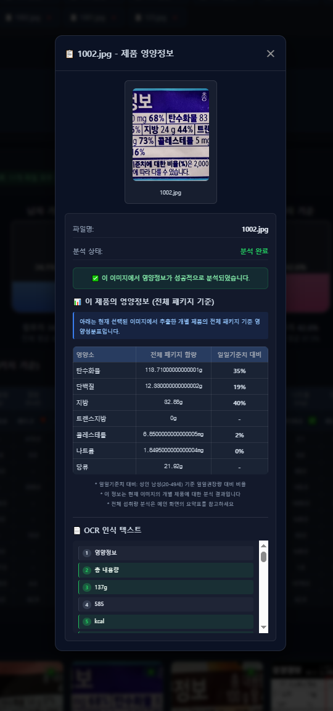

# 영양정보 OCR 시각화 (Flask + Naver Cloud OCR + LLM)

## NIPA-NAVER Cloud Platform Tech 부트캠프

여러 장의 영양 성분표 이미지를 업로드 → Clova OCR → 항목/수치 파싱 → 남/녀 기준 1일 권장섭취량 대비를 **물 채우기 그래프**로 시각화하고, **네이버 클라우드 LLM API**를 활용하여 개인 맞춤형 영양상태 개선 방안을 추천하는 웹 애플리케이션입니다.

## 📱 샘플 이미지 및 화면

### 입력 샘플 이미지
영양성분표가 포함된 식품 포장지 이미지를 업로드하여 분석합니다:



### 전체 분석 화면
업로드된 모든 이미지를 분석하여 종합적인 영양 상태를 보여줍니다:



### 개별 이미지 상세보기
각 이미지를 클릭하면 해당 제품의 상세 영양정보와 OCR 인식 텍스트를 확인할 수 있습니다:



## 🎯 주요 기능

- **🔍 OCR 기반 영양정보 추출**: 네이버 클라우드 Clova OCR로 영양성분표 자동 인식
- **🤖 AI 맞춤 추천**: 네이버 클라우드 HyperCLOVA X LLM으로 개인별 영양 개선 방안 제안
- **📊 시각적 분석**: 물 채우기 그래프로 직관적인 영양 상태 표시
- **👥 성별 맞춤 분석**: 남성/여성 각각의 권장섭취량 기준으로 분석
- **📱 반응형 UI**: 모던하고 사용하기 쉬운 웹 인터페이스
- **🔄 실시간 진행상황**: WebSocket 기반 실시간 분석 진행률 표시

## 1) 준비
1. **네이버클라우드 Clova OCR** 콘솔에서 **엔드포인트 URL**과 **X-OCR-SECRET** 발급.
2. **네이버클라우드 HyperCLOVA X** 콘솔에서 **API 키**와 **엔드포인트** 발급 (AI 추천 기능 사용 시).
3. `.env` 파일을 생성하고 값 채우기 (또는 환경변수로 주입).
4. 필요하면 `rdi.py`의 RDI 값을 정책에 맞게 수정.

## 2) 실행
```bash
python -m venv .venv && source .venv/bin/activate
pip install -r requirements.txt
export $(grep -v '^#' .env | xargs)  # Windows는 set 대신 사용
python app.py
# http://localhost:8000 접속
```

### Docker

```bash
docker build -t nutrition-ocr .
docker run --rm -p 8000:8000 --env-file .env nutrition-ocr
```

## 3) 사용법

* 메인 화면에서 영양성분표 이미지를 **여러 개** 선택해 업로드합니다.
* 각 이미지의 OCR 결과를 파싱하여 **총합**을 계산합니다.
* 남/녀 기준의 **전체 평균 비율**을 사람 실루엣에 채워서 보여주고, 각 항목별 막대바도 표기합니다.

## 4) 커스터마이징

* `parser.py`의 키워드/정규식으로 항목 매칭을 보강하세요(예: 영어 라벨, 순서/레이아웃 변화 등).
* `rdi.py`에서 RDI와 표시 순서를 바꿀 수 있습니다.
* 실루엣 그래프(`static/style.css`, `static/person.js`)는 CSS Mask 기반으로 구현되어 있으며, SVG 마스크를 교체하면 모양/스타일을 쉽게 바꿀 수 있습니다.

## 5) 주의

* OCR 정확도는 원본 해상도, 조명, 왜곡 등에 따라 달라집니다. 업로드 전 **크롭/회전/보정**을 권장합니다.
* 특정 제품은 1회 제공량/100g 기준이 섞여 있을 수 있으니, 파싱 로직에서 기준을 통일하거나 제품별 배수를 반영하도록 확장하세요.

## 폴더 구조

```
nutrition-ocr-app/
├─ app.py
├─ ocr_client.py
├─ parser.py
├─ rdi.py
├─ requirements.txt
├─ README.md
├─ env.example
├─ Dockerfile
├─ templates/
│  ├─ base.html
│  └─ index.html
└─ static/
   ├─ style.css
   └─ person.js
```

## 환경변수 설정

`env.example` 파일을 참고하여 `.env` 파일을 생성하세요:

```
# Flask
FLASK_SECRET=change-me
PORT=8000

# Naver Cloud Clova OCR (필수)
NCP_OCR_ENDPOINT=https://naveropenapi.apigw.ntruss.com/vision-ocr/v1/general
NCP_OCR_SECRET=YOUR_OCR_SECRET

# Naver Cloud HyperCLOVA X LLM (선택 - AI 추천 기능)
NCP_LLM_HOST=https://clovastudio.stream.ntruss.com
NCP_LLM_API_KEY=Bearer YOUR_LLM_API_KEY
NCP_REQUEST_ID=YOUR_REQUEST_ID

# 게이트웨이 키를 쓰는 계정일 경우 (선택)
# NCP_API_KEY_ID=YOUR_API_KEY_ID
# NCP_API_KEY=YOUR_API_KEY
```

> **참고**: LLM API 환경변수가 없어도 기본 영양정보 분석은 가능하며, 이 경우 통계 기반 추천이 제공됩니다.

## 상세 기능

### 📸 이미지 분석
- **다중 이미지 업로드**: 여러 장의 영양성분표를 한 번에 업로드 가능
- **OCR 텍스트 추출**: 네이버클라우드 Clova OCR을 사용하여 이미지에서 텍스트 추출
- **영양성분 파싱**: 한국어 영양성분 키워드를 인식하여 수치 추출
- **이미지별 상세보기**: 개별 이미지 클릭 시 해당 제품의 영양정보와 OCR 텍스트 확인

### 📊 시각화 및 분석
- **물 채우기 그래프**: 직관적인 권장섭취량 대비 비율 표시
- **남녀별 기준**: 남성/여성 각각의 권장섭취량 기준으로 분석
- **실시간 진행률**: WebSocket을 통한 분석 진행상황 표시
- **반응형 UI**: 모던하고 직관적인 웹 인터페이스

### 🤖 AI 추천 시스템
- **맞춤형 영양 분석**: HyperCLOVA X LLM을 활용한 개인별 영양 상태 분석
- **부족 영양소 보충 방안**: 부족한 영양소에 대한 구체적인 식품 추천
- **과다 영양소 감소 방안**: 과다 섭취 영양소에 대한 개선 방법 제안
- **성별 맞춤 추천**: 남성/여성 생리적 특성을 고려한 차별화된 추천
- **마크다운 형식**: 구조화된 형태로 읽기 쉬운 추천 내용 제공

## 🛠️ 기술 스택

### Backend
- **Flask**: 웹 애플리케이션 프레임워크
- **Flask-SocketIO**: 실시간 통신 (WebSocket)
- **Requests**: HTTP 클라이언트 라이브러리
- **Python 3.8+**: 메인 개발 언어

### Frontend  
- **HTML5/CSS3**: 마크업 및 스타일링
- **JavaScript (ES6+)**: 클라이언트 사이드 로직
- **Socket.IO Client**: 실시간 통신 클라이언트
- **Marked.js**: 마크다운 렌더링

### External APIs
- **Naver Cloud Clova OCR**: 이미지 텍스트 인식
- **Naver Cloud HyperCLOVA X**: 대화형 AI 언어모델
- **WebSocket**: 실시간 진행상황 업데이트

### Development & Testing
- **unittest**: 단위 테스트 프레임워크  
- **Docker**: 컨테이너화 지원
- **Git**: 버전 관리